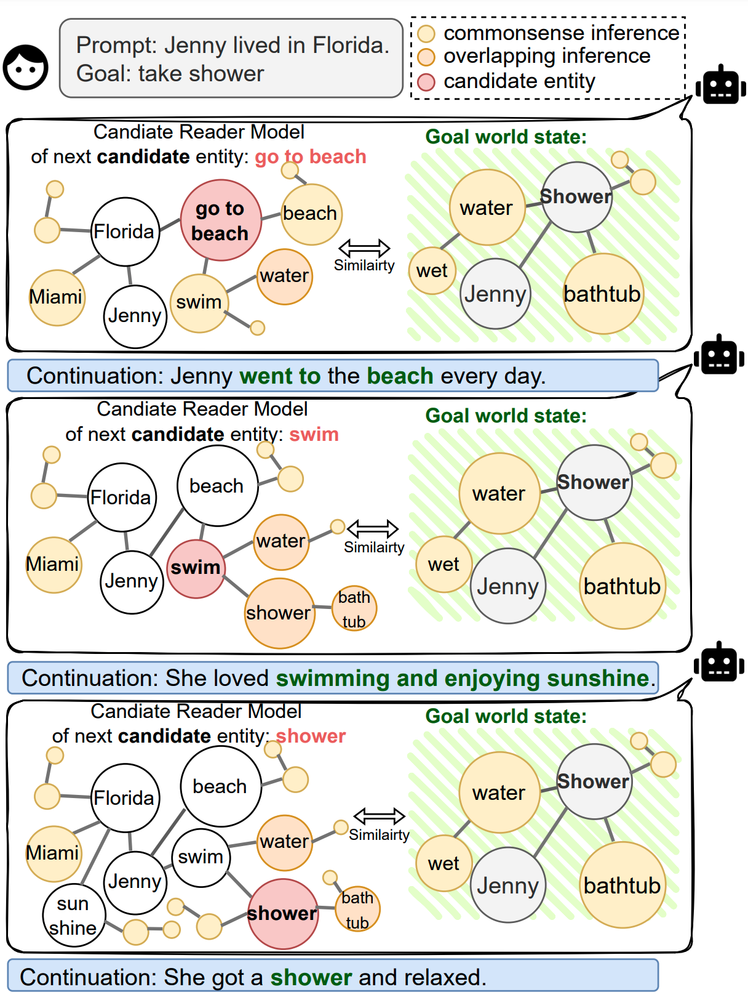
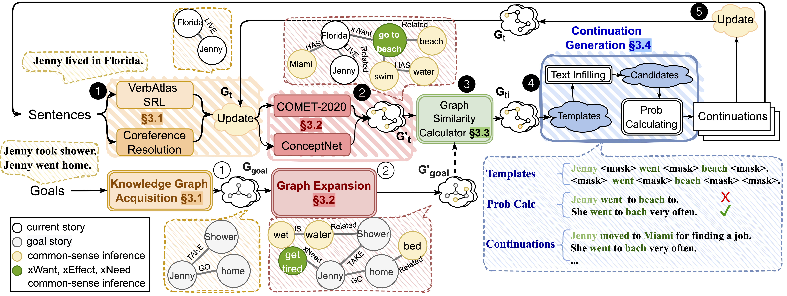

# Reader Model Instructions


Data can be found [here](https://github.gatech.edu/xpeng62/ReaderModel/blob/comet/data/storycommonsense_data.zip)
## :boom: Installation
1. Virtual env: `conda env create -f environment.yml python=3.6`
2. Install the [COMeT](https://github.com/atcbosselut/comet-commonsense)
    - Follow the instruction [here](https://github.gatech.edu/xpeng62/ReaderModel/blob/comet/comet-commonsense/README.md).
    - There are some extra packages you need to install here.
    ```ruby
    conda install -c pytorch pytorch
    pip install ftfy
    ```
    - First, download the pretrained models from [here](https://drive.google.com/open?id=1FccEsYPUHnjzmX-Y5vjCBeyRt1pLo8FB).

    - Then untar the file:
            
    ```ruby
    tar -xvzf pretrained_models.tar.gz
    ```

    - Then run the following script to interactively generate arbitrary ATOMIC event effects:
        
    ```ruby
      python scripts/interactive/atomic_single_example.py --model_file pretrained_models/atomic_pretrained_model.pickle
    ```
 
    - Some absolute paths have to be changed [here](https://github.gatech.edu/xpeng62/ReaderModel/blob/comet/comet-commonsense/src/interactive/functions.py).    

    - How to use COMeT to convert sentence as knowledge graph?   

    ```ruby
    python KG_gen/KG_gen.py
    ``` 
        
3. Install verbatlas SRL
    - The file is located at `./verbatlas/src`
    - Installation follows [here](https://github.gatech.edu/xpeng62/ReaderModel/tree/master/verbatlas)
4. No need to prepare for verbnet parser. Location: `./semparse-core/`
5. Install allennlp and allennlp-model based on [HERE](https://github.gatech.edu/xpeng62/ReaderModel/tree/allennlp).
6. Install new comet-atomic 2020 [HERE](https://github.gatech.edu/xpeng62/ReaderModel/tree/comet/comet-atomic-2020).

### Possible Bugs!!!
1. Pattern cannot used in python 3.7
[Solution](https://github.com/clips/pattern/issues/282)

2. No module named '_ctypes'

```ruby
sudo apt-get install libffi-dev
```

3. When run SRL, get ` __init__() got an unexpected keyword argument 'max_n'`

```ruby
pip uninstall py-rouge
pip install py-rouge
```

## Pipeline for RM in KG-gen



```ruby
cd verbatlas/src&&gunicorn --workers 4 --bind 0.0.0.0:5000 wsgi:app
cd verbnet-approach/src&&python main.py --trainer_type KG_diff_file --topk 2 --story_length 3 --KG_use --remain_div
cd verbnet-approach/src&&python main.py --trainer_type KG_diff_step_file --topk 5 --story_length 10 --KG_use --remain_div --look_ahead 1 --seed 3
```

### :heavy_heart_exclamation: KG / State Transition
Given a state, RM will output action space and then human choose an action, and RM will generate a new state.
This is the code you need to run in the command line. However, there might need some modification for the absolute path.
I have tried my best to convert all the absolute path to relative ones. Pls LMK if there still exist any absolute path. Thanks.

#### :sweat_drops: Functions

For generating action space and new state, the main file is [here](verbnet-approach/src/reader_model_kg_step.py).     
- `define_roles()`: Find role/ character names in the sentence.
- `prepare_next_step()`: Use the parser, construct or add nodes in KG
- `generate_actions()`: Given the KG and then generate all the possible action space.
- `forward()`: Different round will trigger different functions. It will be called in [main.py](verbnet-approach/src/main.py) and move one sentence forward.

#### :star_struck: Features (defined [here](https://github.gatech.edu/xpeng62/ReaderModel/blob/master/verbnet-approach/src/main.py))
* `trainer_type`: `QA` or `generation` or `KG` or `KG_diff` or `KG_diff_file`, We are using `KG_diff_file` as default.
* `model_name_or_path`: GPT-2's pretrained model path
* `mapping_file` and `verbnet_json`: path of verbnet files.
* `target_path`: path to save kg visualization
* `model_file`: COMeT path
* [BART](https://huggingface.co/transformers/v2.11.0/model_doc/bart.html) is used to fill in the verbs. The model is `facebook/bart-large`
* GPT-2 finetuned on ROC is used to generate the sentence after we have verb and noun.
* `--KG_use`: whether to use KG to update the game state
* `--topk`: int, # of sentence for each round we remain.
* `--action_standard`: Use verb or sentence as actions. Now we are using `sentence` as default.
* `--remain_div`: half of the candidates have different prompts
* `--story_length`: length of the generated story
* `--look_ahead`: only apply to `trainer_type=KG_diff_step_file` or `trainer_type=KG_diff_step`, `m_1` in the paper.

#### :clown_face: Steps
1. Given the first natural language sentence, generate a KG based on verb-atlas. _EX. "Jenny lived in Florida." => (Jenny, LOC, Florida), (Jenny, state, Alive)._ Also outputs the syntax with verbnet.

    1. Detect the role name/ sub with name entity recognition.
        We only consider the first person now and will use his/her name as sub for the following sentence for now.
    2. [Verbatlas](http://verbatlas.org/api-documentation) is used to extract relation triples from prompt.
        When we see ARG-LOC in the prompt, we will add a loc node.
    3. Build a KG with networkx package.


2. Use [ConceptNet](https://github.com/commonsense/conceptnet5/wiki/API) and comet-atomic 2020 .to expand the graph.


3. Generate sentence. Generate multiple sentence candidates.
    1. The obj is chosen from entity in the graph (only the inference from ConceptNet, and noun.)
        Also consider obj from reference
    
    2. Generate several sentence by filling different number of mask tokens by [Roberta](https://huggingface.co/transformers/model_doc/roberta.html)
    
    3. Use fine-tuned GPT-2 to obtain the probability of each generated sentence in step 2. Only remain the one with highest prob.
    
    4. [Optional] Use Allennlp TE model to check whether the sentence can entail the previous sentence.


4. Return all the possible actions (sentences) and then calculate the graph difference from the old_KG + new candidate with goal graph


5. Choose one action and then run parser to get nodes and add nodes to KG.

### Pipeline for RM in QA
We plan to use RM model to do a QA with inference.

        cd verbnet-approach/src&&python main.py --trainer_type QA

#### Steps
* Generate KG on the 1st sentence of one story
    * Use [VerbAtlas](http://verbatlas.org/api-documentation)
    * Use COMeT and GLUCOSE to generate inference.
* Generate a new KG on the 2nd sentence of one story, same with the 1st one.
* Deal with Conflicts between the 1st and 2nd KG
    * When the node/sub name and edge name/ relationship are the same; if they can happen at the same time, remain both of them.
      _For example, node name is 'Jenny', and edge name is 'state', the node/obj in the 1st KG is 'cute', and 2nd one is 'smart'.
      We can just combine these two as a larger KG directly._
    * If they can NOT happen at the same time, only remain the one in the latest KG.
      _For example, ['Jenny', 'state', 'alive'] in the 1st KG and ['Jenny', 'state', 'dead'] in the 2nd conflict. 
      So only remain ['Jenny', 'state', 'dead']._
* Keep summing up and substracting KG until finishing the story.
* Use the final big KG to do the QA.


  

